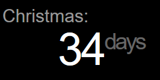
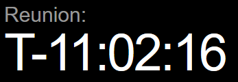

# MMM-CountDown

This is a module for the [MagicMirror²](https://github.com/MichMich/MagicMirror/) which can count down the days to a date/event, or up from a date/time

 

## Why?
Yes, there's another CountDown module, and again I didn't like the style/output, and wanted to have a few customizations that I didn't think fit with [the original](https://github.com/boazarad/MMM-CountDown) by [Boaz](https://github.com/boazarad).  This module is really meant for countdown/up to/from days within the year, and thus only has a "Days" label, and a "T-" countdown when within 24hrs of the target date.

## How?
### Manual install

1. Clone this repository in your `modules` folder:
  ```bash
  cd ~/MagicMirror/modules # adapt directory if you are using a different one
  git clone https://github.com/daterrell/MMM-CountDown.git
  ```
2. Add the module to your `config/config.js` file.
  ```js
  {
    module: 'MMM-CountDown',
    position: 'bottom_center',
    config: {
        // See configuration options
    }
  },
  ```

## Configuration options

| Option           | Description                                                                                                           |
| ---------------- | --------------------------------------------------------------------------------------------------------------------- |
| `position`       | *Required* Where do you want to place the counter (use standard magicmirror positions)                                |
| `event`          | *Required* Label of event to count down to (displayed above counter)                                                  |
| `date`           | *Required* Date to count down to (YYYY-MM-DD *or* YYYY-MM-DDTHH:MM:SS)                                                |
| `daysLabel`      | *Required* What to show for "days" label                                                                              |
| `toTime`         | *Optional* *false* When counting down to a time, don't show "TODAY!", but instead count down to a specific time       |
| `allowNegative`  | *Optional* Show a countUP timer; time/days since a specific date (ex. baby is X days old)                             |
